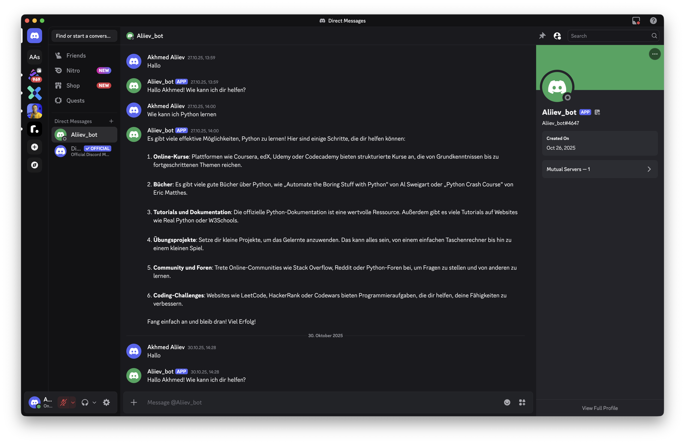

# OpenAI-MultiBot
Telegram- und Discord-Bot, der mithilfe der OpenAI-API intelligente Konversationen führt und Nachrichten zwischen Plattformen synchronisiert

# Telegram/Discord Ask Bot

Ein kompaktes Python-Projekt, das Telegram- und Discord-Bots mit OpenAI verbindet. Der Telegram-Bot reagiert auf beliebige Nachrichten im Chat und merkt sich den kurzfristigen Dialogkontext. Im Discord-Server antwortet der Bot sowohl auf normale Nachrichten als auch über den Befehl `!ask`.

## Schnellstart

1. Repository klonen und eine virtuelle Umgebung anlegen.
2. Abhängigkeiten installieren:
   ```bash
   pip install -r requirements.txt
   ```
3. Eine `.env`-Datei auf Basis von `.env.example` anlegen und die Tokens eintragen:
   - `TELEGRAM_BOT_TOKEN` — über @BotFather erzeugen.
   - `DISCORD_BOT_TOKEN` — im Developer Portal erstellen (der Bot benötigt den `MESSAGE CONTENT INTENT`).
   - `OPENAI_API_KEY` sowie optional `OPENAI_MODEL`.
   - Zusätzliche Optionen:
     - `ASK_SYSTEM_PROMPT` — individuelle Systemanweisung für das Modell.
     - `MAX_HISTORY_TURNS` — Anzahl der Gesprächsrunden, die für den Kontext gespeichert werden (Standard: 5).
4. Gewünschte Plattform starten:
   ```bash
   python main.py --platform telegram
   # oder
   python main.py --platform discord
   ```

## Funktionsweise

- `bots/config.py` — lädt Umgebungsvariablen mithilfe von `python-dotenv`.
- `bots/openai_client.py` — sendet Anfragen an OpenAI und speichert den jüngsten Verlauf.
- `bots/telegram_bot.py` — antwortet auf alle Textnachrichten und unterstützt die Befehle `/start`, `/ask` (für Kompatibilität) und `/reset` (Verlauf löschen).
- `bots/discord_bot.py` — reagiert auf freie Nachrichten sowie auf `!ask`/`!reset` und verwaltet den Kontext kanalweise.
- `main.py` — wählt anhand des Arguments die Plattform und startet den entsprechenden Bot.

## Nächste Schritte

- Caching oder Rate-Limiting ergänzen.
- Weitere Befehle integrieren (z. B. Bildgenerierung).
- Bot auf einem Server oder einer serverlosen Plattform deployen.
## 📸 Screenshot


